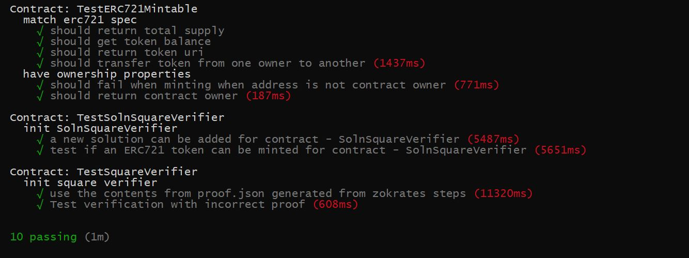
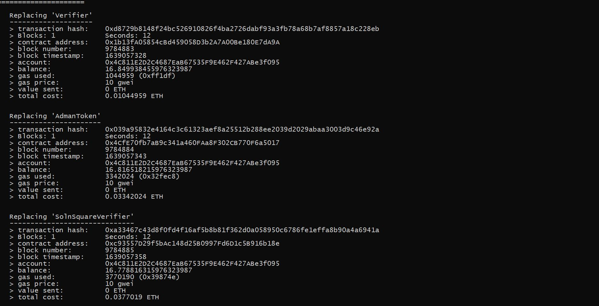
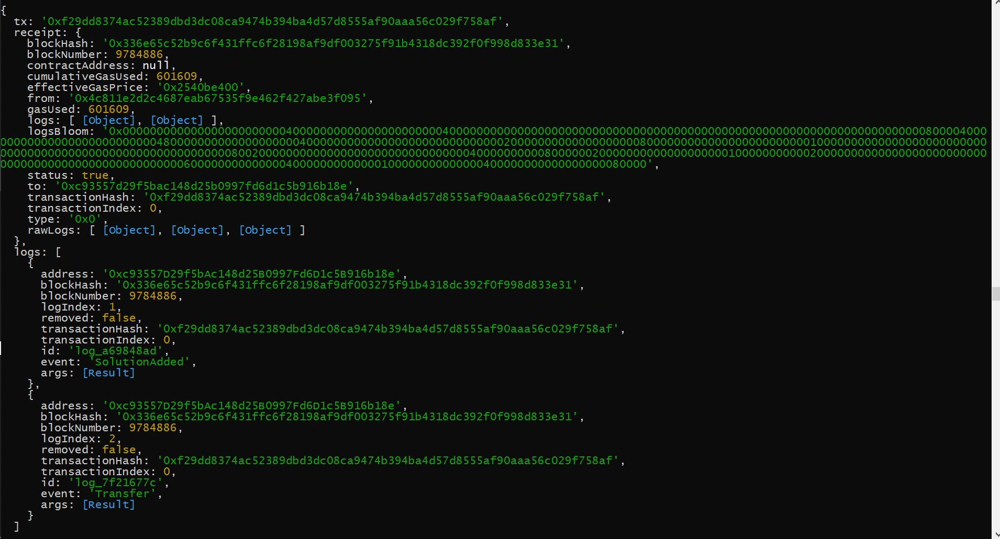
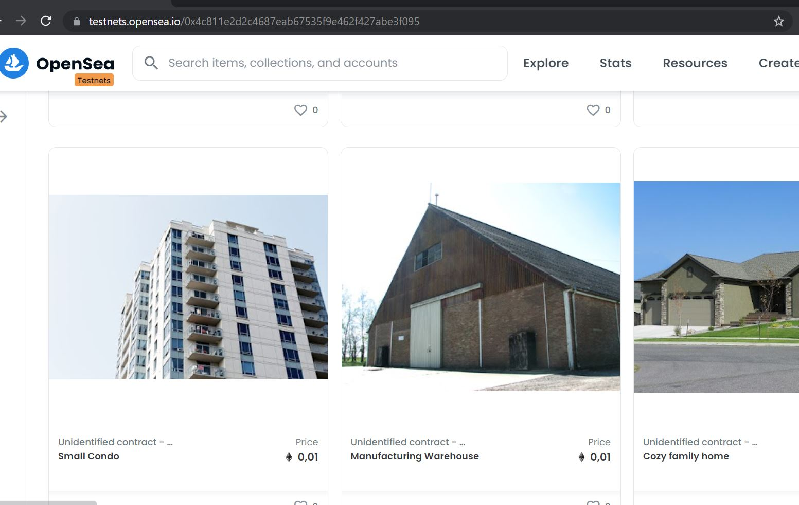
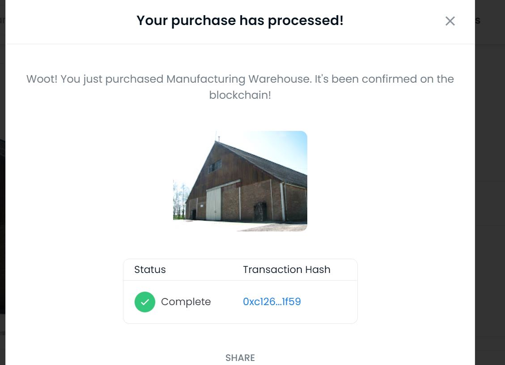
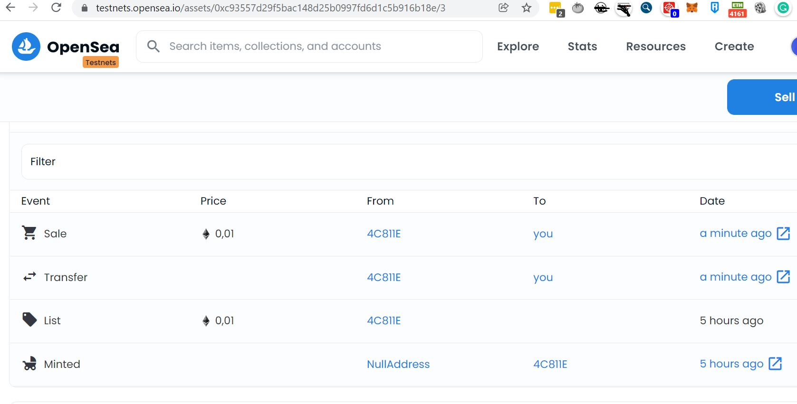

# Udacity Blockchain Capstone
The main objective of this project is to build a decentralized housing marketplace using the ERC721 standard Tokens and OpenSea.

## 1 Install
This repository contains Smart Contracts code written in solidity & tests using javascript.
to install, download or clone the repo, then:

* `npm install`
* `truffle compile`

## 2 Run tests
truffle test

## 3 Deploy to rinkeby
truffle migrate --network rinkeby --reset

### 3.1 Verifier address
0x1b13fA05854cBd459058D3b2A7A00Be180E7dA9A

### 3.2 AdmanToken address
0x6E0B2BD5Ee01E3A11AAdB139D3BA6dF73eac5F38

### 3.3 SolnSquareVerifier address
0xc93557D29f5bAc148d25B0997Fd6D1c5B916b18e

### 3.4 Minting console logs after deploy
At the end of the deployment 10 Tokens will be minted automatically.

## 4 Tokens minted
https://testnets.opensea.io/0x4c811e2d2c4687eab67535f9e462f427abe3f095

## 5 Buy one of the tokens on opensea

### 5.1 Token sold activity, buy 5 more NTFS with the buyer's account
https://testnets.opensea.io/0x7ca2c3c7dece420c97889c06e26bdfdcc802ac95?tab=activity

### 5.2 Seller's address
0x4C811E2D2C4687EaB67535F9E462F427ABe3f095

### 5.3 Buyer's address
0x7Ca2C3c7deCE420c97889C06e26BDFDcC802aC95

### 5.4 Transfer transaction on etherscan
https://rinkeby.etherscan.io/tx/0xc126a099e117e38eac3c67b77376b8dad727a0d5f9c05a6e0c02730461771f59

### Contract Abi
https://raw.githubusercontent.com/admanadel/Blockchain-Capstone/master/eth-contracts/build/contracts/AdmanToken.json
https://github.com/admanadel/Blockchain-Capstone/tree/master/eth-contracts/build/contracts

## Dependencies versions
* Truffle v4.1.14
* Solidity ^0.5.0
* NPM 6.14.13
* Node v14.17.1

# Project Resources

* [Remix - Solidity IDE](https://remix.ethereum.org/)
* [Visual Studio Code](https://code.visualstudio.com/)
* [Truffle Framework](https://truffleframework.com/)
* [Ganache - One Click Blockchain](https://truffleframework.com/ganache)
* [Open Zeppelin ](https://openzeppelin.org/)
* [Interactive zero knowledge 3-colorability demonstration](http://web.mit.edu/~ezyang/Public/graph/svg.html)
* [Docker](https://docs.docker.com/install/)
* [ZoKrates](https://github.com/Zokrates/ZoKrates)
